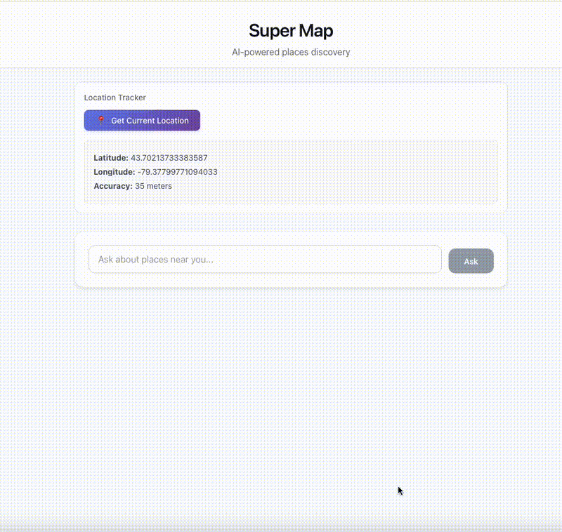

# Super Map

AI-powered places discovery application that helps you find and explore places near you using intelligent queries.



## Features

- **Location Tracking**: Automatically detect and use your current location
- **AI-Powered Search**: Natural language queries to find places (e.g., "find me a cozy coffee shop for studying")
- **Interactive Map**: View discovered places on an interactive map
- **Smart Place Details**: Get detailed information about places including amenities and features
- **Intelligent Filtering**: AI analyzes your query to understand what type of places you're looking for

## Tech Stack

- **Frontend**: React 19 + Vite
- **Styling**: CSS
- **Backend**: Netlify Functions
- **APIs**: OpenAI GPT for intelligent query processing, Google Places for location data
- **Testing**: Vitest (unit tests) + Playwright (e2e tests)

## Getting Started

### Prerequisites

- Node.js (version 18 or higher)
- npm or yarn

### Installation

1. Clone the repository:
   ```bash
   git clone https://github.com/tourank/super-map.git
   cd super-map
   ```

2. Install dependencies:
   ```bash
   npm install
   ```

3. Set up environment variables:
   Create a `.env` file in the root directory and add your API keys:
   ```
   OPENAI_API_KEY=your_openai_api_key_here
   ```

4. Start the development server:
   ```bash
   npm run dev
   ```

5. Open your browser and navigate to `http://localhost:5173`

## Available Scripts

- `npm run dev` - Start development server
- `npm run build` - Build for production
- `npm run preview` - Preview production build
- `npm run lint` - Run ESLint
- `npm run test` - Run unit tests
- `npm run test:ui` - Run tests with UI
- `npm run test:run` - Run tests once
- `npm run test:e2e` - Run end-to-end tests
- `npm run test:e2e:ui` - Run e2e tests with UI
- `npm run test:all` - Run all tests (unit + e2e)

## How It Works

1. **Location Detection**: The app requests your location to provide relevant nearby results
2. **Natural Language Processing**: Your query is processed by AI to understand what you're looking for
3. **Smart Search**: The system searches for places that match your criteria
4. **Intelligent Analysis**: AI analyzes place data to provide contextual recommendations
5. **Interactive Results**: View results on a map with detailed information

## Project Structure

```
src/
├── components/
│   ├── LocationTracker.jsx      # Handles user location detection
│   ├── IntelligentPlacesQuery.jsx # Main query interface and results
│   ├── MapView.jsx              # Interactive map component
│   └── __tests__/               # Component tests
├── utils/
│   ├── amenityDetection.js      # AI-powered amenity analysis
│   ├── locationUtils.js         # Location utility functions
│   └── __tests__/               # Utility tests
├── constants/
│   └── index.js                 # App constants
└── App.jsx                      # Main application component

netlify/functions/               # Serverless functions
├── search-places.js            # Place search endpoint
├── query-llm.js                # AI query processing
└── place-details.js            # Detailed place information
```

## Deployment

This project is configured for deployment on Netlify:

1. Build the project:
   ```bash
   npm run build
   ```

2. Deploy to Netlify (the `netlify.toml` file contains the deployment configuration)

3. Set environment variables in your Netlify dashboard

## Contributing

1. Fork the repository
2. Create a feature branch
3. Make your changes
4. Add tests for new functionality
5. Run `npm run test:all` to ensure all tests pass
6. Submit a pull request

## License

This project is open source and available under the MIT License.
